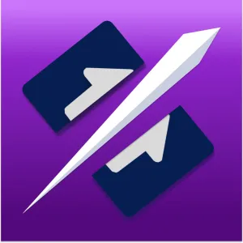
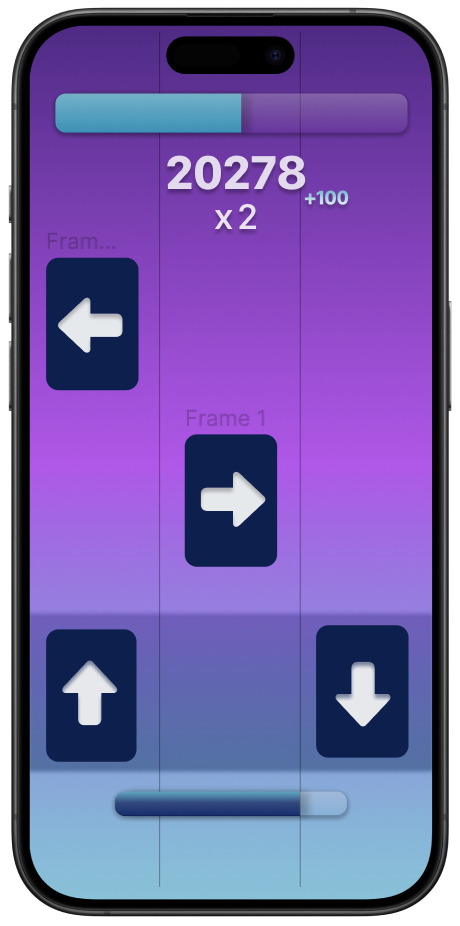
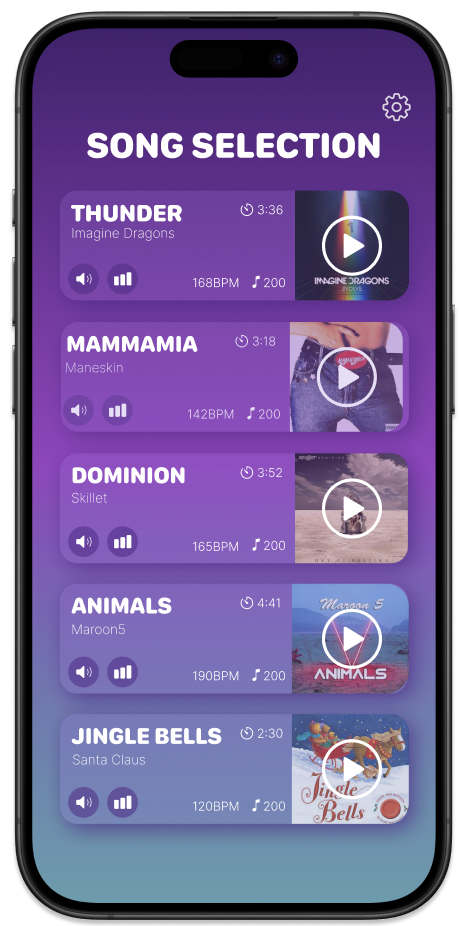
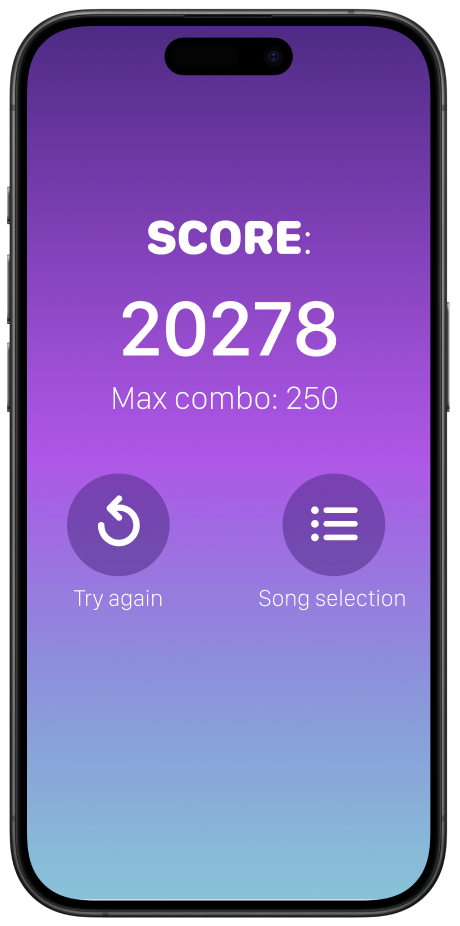
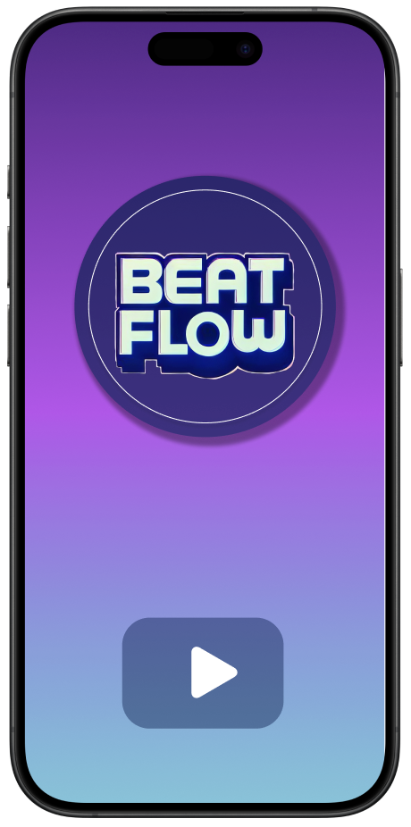

# BeatFlow

**BeatFlow** is a dynamic music game built in Swift using the powerful SpriteKit library. Fusing elements inspired by hits like Piano Tiles and Beat Saber, BeatFlow invites players to immerse themselves in a rhythmic adventure where the main task is to cut musical notes that flow across the screen to the beat of the music. Each note must be cut in the right direction, testing the player's precision and reflexes.

## Main Features

### Rhythmic and Engaging Gameplay

Challenge yourself with levels that require an excellent sense of rhythm and an ever-increasing speed of reaction. The game starts easy but becomes more challenging as you progress, requiring quick reflexes and precise timing.

### Visual Aesthetics and Smooth Animations

Experience elegant graphics and smooth animations, quality features of SpriteKit. The visual design is crafted to provide an immersive and enjoyable experience, making each session of gameplay visually appealing.

### Continuous Updates

BeatFlow is constantly expanding, with new tracks and levels added regularly to keep the game fresh and challenging. Our commitment to continuous updates ensures that there is always something new to look forward to.

## How to Play

1. **Select a Song:**
   
   Choose your favorite track from a wide selection of songs. Each song has its unique rhythm and difficulty level.

2. **Play the Game:**
   
   Cut the notes in the direction indicated by the arrows. Keep up with the rhythm and aim for the highest score possible.

3. **Check Your Score:**
   
   After completing the song, review your score and see how well you did. Try to beat your high score and achieve a perfect combo!

Thank you for choosing BeatFlow! We hope you enjoy the rhythmic challenge and the immersive experience it offers. Keep an eye out for new updates and tracks!
